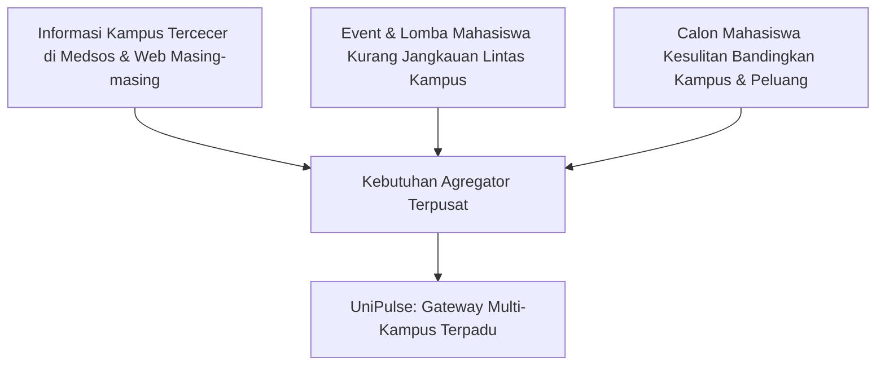
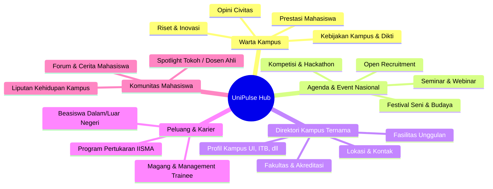
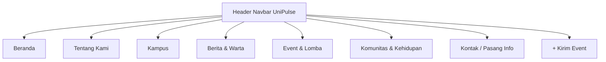
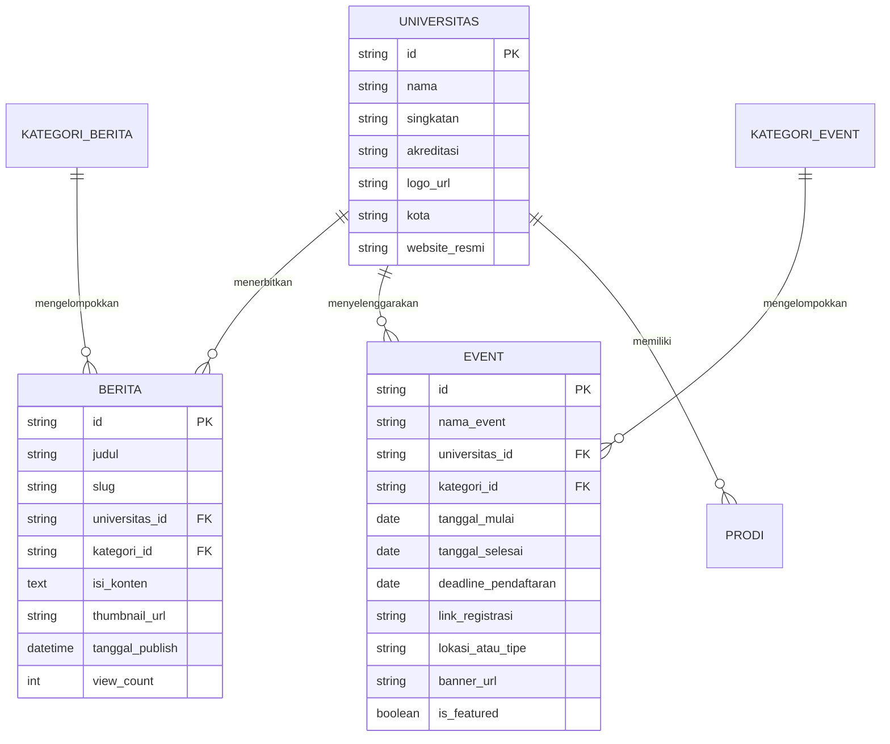
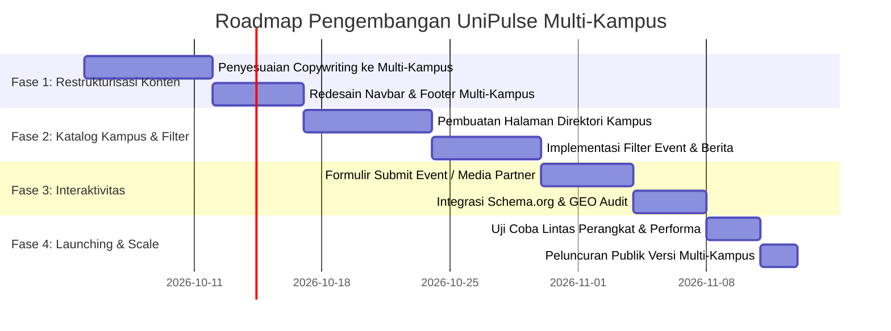

# Product Requirement Document (PRD)
## UniPulse (Portal Kampus) — Gateway & Agregator Informasi Multi-Kampus Terpadu

---

| Dokumen | Keterangan |
| :--- | :--- |
| **Nama Produk** | **UniPulse / Portal Kampus** |
| **Tipe Produk** | Platform Web Portal & Agregator Media Kampus (*Multi-Campus Information Hub*) |
| **Target Rilis** | Q4 2026 |
| **Status Dokumen** | **Disetujui / Versi 1.0 (Pivoting ke Multi-Kampus)** |
| **Stakeholder Utama**| Calon Mahasiswa, Mahasiswa Aktif, BEM/UKM Kampus, Humas Universitas, Alumni |

---

## 1. Executive Summary & Visi Produk

### 1.1 Visi
Menjadikan **UniPulse (Portal Kampus)** sebagai *The Ultimate Gateway* dan sentral media informasi kampus #1 di Indonesia—menyatukan arus berita, riset, kalender kegiatan/event nasional, beasiswa, hingga dinamika kehidupan mahasiswa dari berbagai kampus ternama ke dalam satu portal terpadu, interaktif, dan mudah diakses.

### 1.2 Latar Belakang & Perubahan Arah (*Pivoting*)
Sebelumnya, template website ini dirancang untuk merepresentasikan satu institusi tunggal (single-campus). Dengan arahan baru, proyek bertransformasi menjadi **platform multi-kampus**:
- Tidak eksklusif untuk satu universitas saja.
- Menjadi wadah kurasi informasi dari puluhan universitas ternama (PTN/PTS seperti UI, ITB, UGM, ITS, Unair, Undip, IPB, Binus, Telkom University, dll.).
- Memudahkan kolaborasi, kompetisi, dan pertukaran informasi lintas civitas akademika di seluruh nusantara.

---

## 2. Problem Statement & Peluang Pasar

### 2.1 Masalah Pengguna (*Pain Points*)
1. **Informasi Terfragmentasi (*Siloed Information*)**: Tiap universitas memiliki portal berita, akun Instagram UKM, dan situs fakultas yang terpisah. Mahasiswa kesulitan memantau perkembangan kampus lain.
2. **Jangkauan Event Terbatas**: Panitia lomba, seminar, dan festival kampus kesulitan mempromosikan kegiatan ke luar almamaternya tanpa budget promosi besar.
3. **Calon Mahasiswa Bingung**: Siswa SMA/SMK harus berpindah-pindah puluhan website universitas untuk mencari info jurusan, akreditasi, tanggal seleksi, dan beasiswa.
4. **Minim Ruang Kolaborasi Lintas Kampus**: Belum ada hub netral yang menjadi wadah diskusi dan ekspresi karya mahasiswa dari berbagai perguruan tinggi.

### 2.2 Nilai Tambah (*Value Proposition*)
- **Bagi Mahasiswa**: Satu tempat untuk mencari info lomba nasional, webinar bersertifikat, beasiswa, dan lowongan magang.
- **Bagi Organisasi Kampus (BEM/HIMA/Panitia Event)**: Saluran publikasi gratis & efektif untuk mendistribusikan poster acara ke audiens se-Indonesia.
- **Bagi Calon Mahasiswa**: Ensiklopedia perbandingan kampus ternama, ulasan jurusan, dan agenda open house/tryout.
- **Bagi Perguruan Tinggi**: Media exposure untuk prestasi riset, dosen unggulan, dan program inovatif kepada masyarakat luas.

---

## 3. Target User Personas

| Persona | Profil & Karakteristik | Kebutuhan Utama pada Platform |
| :--- | :--- | :--- |
| **Siswa SMA / Calon Mahasiswa** (*Dimas, 17 th*) | Siswa kelas 12 yang sedang riset jurusan dan persiapan SNBP/SNBT/Seleksi Mandiri. | Direktori profil kampus ternama, passing grade, info beasiswa awal masuk, jadwal open house. |
| **Mahasiswa Aktif** (*Sarah, 20 th*) | Mahasiswa semester 4 yang aktif berorganisasi dan ambisius mengikuti kompetisi. | Kalender lomba nasional, webinar, call for papers, peluang magang, tips skripsi/kuliah. |
| **Panitia Event / BEM** (*Rian, 21 th*) | Pengurus humas UKM/BEM yang bertugas mempublikasikan acara tahunan kampus. | Fitur *Submit Event*, spotlight promosi acara, reach audiens lintas kota dan universitas. |
| **Alumni & Recruiter** (*Maya, 26 th*) | Profesional muda & HR startup yang mencari talenta mahasiswa berprestasi. | Pantauan riset inovatif kampus, prestasi mahasiswa, peluang kemitraan kampus. |

---

## 4. Pilar Fitur Utama (*Core Feature Pillars*)

### 4.1 Pilar 1: Warta & Berita Multi-Kampus (*Campus News Wire*)
- **Feed Berita Dinamis**: Menampilkan berita kurasi dari berbagai kampus dengan badge/tag nama universitas (contoh: `[UGM]`, `[ITB]`, `[UI]`).
- **Kategori Berita**:
  - *Riset & Teknologi*: Publikasi riset terobosan dosen dan mahasiswa.
  - *Prestasi & Penghargaan*: Kemenangan delegasi di kancah nasional/internasional.
  - *Kabar Kampus*: Kebijakan rektorat, wisuda akbar, peringatan dies natalis.
- **Filter Asal Kampus**: Pembaca dapat memfilter: *"Tampilkan hanya berita dari Institut Teknologi Bandung"* atau *"Semua Kampus"*.

### 4.2 Pilar 2: Kalender Event & Kegiatan Nasional (*National Campus Events*)
- **Katalog Event Terkategori**:
  - Kompetisi akademik, Hackathon, Business Plan, Debat.
  - Workshop & Webinar (Online / Offline / Hybrid).
  - Konser kampus, Dies Natalis, Turnamen Futsal/Basket antar kampus.
- **Filter Multi-Dimensi**:
  - Biaya: *Gratis* / *Berbayar*.
  - Moda: *Online* / *Offline* (Filter Kota: Jabodetabek, Bandung, Yogyakarta, Surabaya, dsb.).
  - Target: *Siswa SMA*, *Mahasiswa D3/S1/S2*, *Umum*.
- **Integrasi "Daftar Event"**: Tombol langsung menuju Google Form atau platform tiket panitia.
- **Countdown Timer**: Pengingat tenggat waktu pendaftaran lomba.

### 4.3 Pilar 3: Direktori Kampus Ternama (*Campus Directory*)
- **Eksplorasi Profil Kampus**: Halaman profil komprehensif untuk masing-masing universitas mitra/terpilih.
- **Data per Kampus**:
  - Nama resmi, logo, singkatan, akreditasi BAN-PT, peringkat (QS/THE).
  - Daftar fakultas dan program studi unggulan.
  - Galeri fasilitas ikonik (Perpustakaan pusat, lab riset, student center).
  - Alamat kampus utama & cabang, peta interaktif, dan tautan ke situs resmi.

### 4.4 Pilar 4: Sentra Peluang & Beasiswa (*Opportunity Center*)
- Kurasi beasiswa aktif (Beasiswa Unggulan, Djarum Beasiswa Plus, LPDP, KIP-Kuliah, Beasiswa Alumni).
- Lowongan magang bersertifikat (MBKM, magang BUMN, magang industri teknologi).

### 4.5 Pilar 5: Partisipasi Pengguna (*Community & Event Submission*)
- **Fitur "Kirim Event / Berita"**: Formulir mandiri bagi panitia kampus untuk mengunggah poster, deskripsi, tanggal, dan link pendaftaran acara mereka.
- **Modus Kurasi Cepat**: Verifikasi sebelum tayang untuk memastikan bebas hoaks dan konten tidak pantas.

---

## 5. Arsitektur Informasi & Navigasi (Sitemap Baru)

Perubahan struktur navigasi dari format single-campus ke multi-campus hub:

### Rekomendasi Struktur Menu Navbar:
1. **Beranda** (`beranda.html`): Dashboard agregator, hero highlight event besar minggu ini, berita terpopuler, galeri direktori kampus favorit.
2. **Kampus** (`akademik.html` &rarr; pivot menjadi `direktori-kampus.html` atau halaman eksplorasi kampus): Direktori perguruan tinggi ternama di Indonesia.
3. **Berita** (`berita.html`): Berita kurasi multi-kampus dengan tag universitas dan filter kategori.
4. **Event** (`kegiatan.html`): Kalender kegiatan lomba, seminar, workshop, festival antar universitas.
5. **Komunitas** (`kehidupan-mahasiswa.html` & `alumni.html`): Cerita mahasiswa, tips perkuliahan, profil alumni sukses lintas kampus.
6. **Kontak & Kirim Info** (`kontak.html`): Bantuan, kerja sama media partner kampus, dan formulir submission.

---

## 6. Model Data & Entitas Utama

---

## 7. Desain & Karakter Visual (*UI/UX Direction*)

- **Tone & Mood**: Modern, energetik, kredibel, bersahabat untuk Gen-Z dan akademisi.
- **Warna Identitas**:
  - Warna Utama: *Deep Navy / Sapphire Blue* (melambangkan integritas pendidikan & kredibilitas).
  - Warna Aksen: *Vibrant Coral / Amber Gold* (melambangkan semangat muda, inovasi, dan kehangatan komunitas).
- **Elemen UI Pembeda**:
  - **Badge Kampus Berwarna**: Setiap kampus memiliki tag pengenal (misal kuning khas UI, biru ITB, hijau UGM) untuk mempermudah identifikasi sumber informasi.
  - **Status Card Event**: Label dinamis seperti `[Pendaftaran Dibuka]`, `[Sisa 3 Hari]`, `[Gratis]`.
  - **Search & Filter Bar sticky**: Kolom pencarian instan di bagian atas katalog event dan berita.

---

## 8. Spesifikasi SEO & GEO (Generative Engine Optimization)

Agar UniPulse mendominasi pencarian Google maupun mesin pencari AI (ChatGPT, Perplexity, Gemini):

1. **Schema.org Structured Data**:
   - `NewsArticle` untuk setiap artikel berita, menyertakan atribut `publisher`, `author`, `sourceOrganization`.
   - `Event` untuk kalender kegiatan, menyertakan `startDate`, `endDate`, `eventAttendanceMode`, `offers`.
   - `CollegeOrUniversity` untuk direktori profil kampus.
2. **GEO (Generative Engine Optimization)**:
   - Menyediakan data statistik terstruktur (misal: tanggal penting seleksi, daftar biaya, syarat pendaftaran).
   - Penggunaan heading hierarki yang jelas (`H1`, `H2`, `H3`) berbasis query FAQ umum mahasiswa.
3. **OpenGraph & Twitter Card Dinamis**: Setiap halaman artikel dan event memiliki banner beresolusi 1200x630px dengan metadata lengkap.

---

## 9. Rencana Monetisasi & Keberlanjutan (*Business Model*)

1. **Media Partner & Promoted Events**: Slot banner dan pin teratas untuk festival kampus atau lomba berbayar dari institusi atau brand sponsor.
2. **Dedicated Brand Activation**: Kerjasama dengan brand FMCG, teknologi, atau perbankan yang ingin menyasar mahasiswa di 20+ kampus sekaligus.
3. **Job & Internship Board**: Layanan lowongan magang premium untuk perusahaan yang mencari lulusan kampus ternama.
4. **Afiliasi Edukasi & Sertifikasi**: Rekomendasi kursus persiapan TOEFL/IELTS, bootcamp coding, atau bimbel seleksi kedinasan/pascasarjana.

---

## 10. Roadmap Pelaksanaan (*Phased Implementation*)

---

## 11. Indikator Kunci Keberhasilan (*KPI*)

| Metrik | Target Awal (3 Bulan Pertama) | Target 6 Bulan |
| :--- | :--- | :--- |
| **Jumlah Kampus Terdaftar** | Minimal 15 Perguruan Tinggi Ternama | 50+ Kampus Seluruh Indonesia |
| **Event Aktif per Bulan** | 30+ Kegiatan Nasional | 100+ Kegiatan per Bulan |
| **Monthly Active Users (MAU)**| 25.000 Pengunjung Unik | 100.000+ Mahasiswa/Calon Mahasiswa |
| **Rasio Submit Event Mandiri**| 15% dari total event | 40% dari total event (UGC Mandiri) |
| **Waktu Kunjungan Rata-rata** | > 2 Menit 30 Detik | > 3 Menit 45 Detik |

---
*Dokumen ini disusun untuk menjadi acuan strategis, arsitektural, dan teknis dalam pengembangan website UniPulse (Portal Kampus).*
