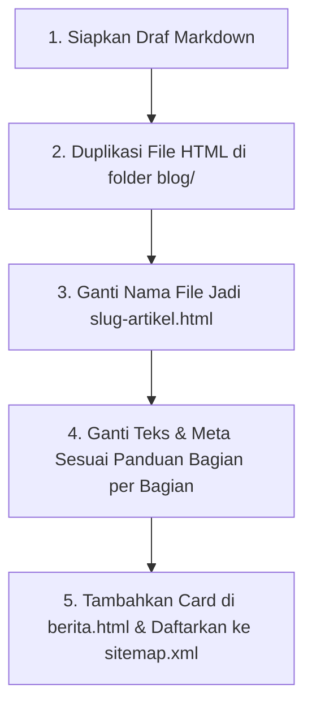
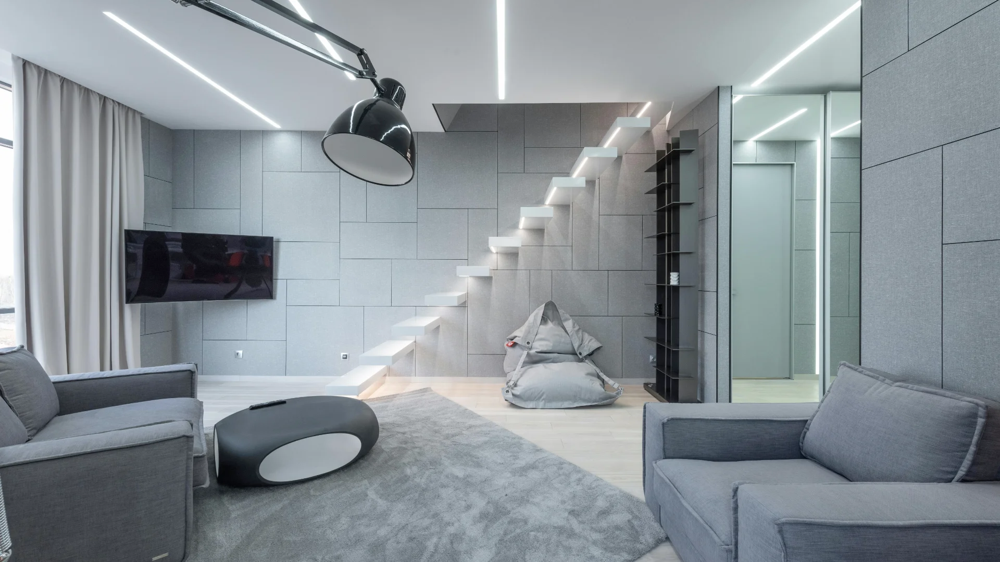

# Panduan Penambahan Artikel Portal Kampus (UniPulse)
## Aturan Baku: "Hanya Ganti Konten / Teks, Jangan Mengubah Struktur Layout & Kelas CSS"

---

| Dokumen | Keterangan |
| :--- | :--- |
| **Tujuan Dokumen** | Panduan standar operasional bagi tim redaksi / konten untuk menambah artikel baru di folder `blog/`. |
| **Prinsip Utama** | **100% Layout Preserved** — Menjaga konsistensi visual, responsivitas, dan standar SEO/GEO tanpa merusak layout. |
| **Lokasi Artikel** | Folder `blog/*.html` |
| **Contoh Hasil Rujukan** | [jadwal-seleksi-mandiri-ptn-2026.html](file:///d:/Magang%20Industri/UniPulse-pro/blog/jadwal-seleksi-mandiri-ptn-2026.html) & [profil-universitas-indonesia.html](file:///d:/Magang%20Industri/UniPulse-pro/blog/profil-universitas-indonesia.html) |
| **Sumber Materi Markdown** | [hari-01-artikel-seo-unipulse.md](file:///d:/Magang%20Industri/UniPulse-pro/hari-01-artikel-seo-unipulse.md) |

---

## 1. Prinsip Dasar & Aturan Emas

> [!IMPORTANT]
> **Aturan Emas:** Saat membuat artikel baru, **JANGAN PERNAH** menghapus tag pembungkus seperti `<div class="col-lg-8">`, `<article class="article-card-wrapper card ...">`, atau mengubah nama-nama class CSS Bootstrap/kustom.
> 
> Anda **HANYA** perlu menduplikasi salah satu file HTML artikel yang sudah ada di folder `blog/`, kemudian **mengganti isi teks, atribut meta, tautan gambar, dan data skema JSON-LD** agar sesuai dengan draf artikel markdown Anda.

---

## 2. Alur Kerja Cepat (5 Langkah Menambah Artikel)



1. **Siapkan Draf Markdown**: Pastikan draf artikel (seperti format di `hari-01-artikel-seo-unipulse.md`) memiliki *Meta Title*, *Slug*, *Meta Description*, *Ringkasan Inti*, *Subheading H2/H3*, *Tabel (jika ada)*, dan *FAQ*.
2. **Duplikasi Template**: Salin file `blog/jadwal-seleksi-mandiri-ptn-2026.html` atau artikel lain di folder `blog/`.
3. **Beri Nama File**: Namai file baru sesuai `slug` artikel (huruf kecil semua, pisahkan dengan tanda strip, akhiri `.html`). Contoh: `jadwal-seleksi-mandiri-ptn-2026.html`.
4. **Ganti Konten Bagian per Bagian**: Ikuti peta anatomi pada Bab 4 (hanya ganti teks, jangan ubah class & layout).
5. **Tambahkan Card di `berita.html` & Daftarkan ke Sitemap**: 
   - **Wajib**: Tambahkan card artikel baru pada halaman `berita.html` dengan tautan mengarah ke folder blog: `href="blog/slug-artikel.html"`.
   - Daftarkan URL ke `sitemap.xml` agar langsung dirayapi mesin pencari.

---

## 3. Peta Anatomi Bagian File HTML (Apa Saja yang Diganti)

Setiap file artikel di folder `blog/*.html` tersusun dari 7 bagian terstruktur:

```
├── 1. <head> (SEO Meta Tags, Open Graph, Twitter Cards)
├── 2. <script type="application/ld+json"> (Schema.org JSON-LD Graph)
├── 3. Header & Navigasi (TETAP SAMA, Jangan Diubah)
├── 4. Page Title & Breadcrumbs
├── 5. Kolom Artikel Utama (.col-lg-8)
│   ├── Category Badge
│   ├── Judul H1
│   ├── Bar Penulis & Waktu Baca
│   ├── Gambar Unggulan (Featured Image & Caption)
│   ├── Paragraf Pembuka (Lead Paragraph)
│   ├── Kotak Ringkasan Inti (.summary-box)
│   ├── Kotak Daftar Isi Interaktif (.toc-box)
│   ├── Tubuh Konten (.blog-detail-content): H2, H3, Paragraf, Tabel, Quote, Promo Banner
│   ├── Accordion Tanya Jawab (FAQ)
│   ├── Tombol Bagikan Sosial Media (Share Buttons)
│   └── Tag Footer (.article-tags-footer)
├── 6. Kolom Sidebar Kanan (.col-lg-4)
│   ├── Kartu Penulis (.sidebar-author-card)
│   └── Rekomendasi Artikel Lain (.sidebar-related)
└── 7. Footer & Script (TETAP SAMA, Jangan Diubah)
```

---

## 4. Panduan Penggantian Kode Detail (Bagian per Bagian)

### Bagian 1: Metadata `<head>` (SEO & Media Sosial)
Buka file HTML baru Anda, lalu cari baris 7–28 di bagian `<head>`. Ganti teks yang berada di dalam tanda kutip:

```html
<!-- GANTI judul halaman (Title Tag) -->
<title>Jadwal Seleksi Mandiri PTN 2026: Panduan Lengkap Tanggal, Syarat, dan Cara Daftar | UniPulse</title>

<!-- GANTI deskripsi meta (150-160 karakter) -->
<meta name="description" content="Lihat jadwal seleksi mandiri PTN 2026 lengkap: UI, UGM, Unair, syarat, biaya, dan cara daftar. Baca panduannya dan susun rencana masuk kampus Anda sekarang.">

<!-- GANTI kata kunci (keywords) -->
<meta name="keywords" content="jadwal seleksi mandiri PTN 2026, SIMAK UI 2026, seleksi mandiri UGM, mandiri Unair">

<!-- GANTI canonical URL sesuai slug baru -->
<link rel="canonical" href="https://portalkampus.ac.id/blog/SLUG-ARTIKEL-BARU.html">

<!-- GANTI Open Graph & Twitter Cards -->
<meta property="og:url" content="https://portalkampus.ac.id/blog/SLUG-ARTIKEL-BARU.html">
<meta property="og:title" content="Judul Artikel Anda">
<meta property="og:description" content="Deskripsi singkat artikel...">
<meta property="og:image" content="https://portalkampus.ac.id/assets/img/blog/NAMA-GAMBAR.webp">

<meta name="twitter:title" content="Judul Artikel Anda">
<meta name="twitter:description" content="Deskripsi singkat artikel...">
<meta name="twitter:image" content="https://portalkampus.ac.id/assets/img/blog/NAMA-GAMBAR.webp">
```

---

### Bagian 2: Skema Data Terstruktur (Schema.org JSON-LD)
Cari blok `<script type="application/ld+json">`. Ganti nilai-nilai berikut:
- `"headline"`: Samakan dengan Judul H1 artikel.
- `"description"`: Samakan dengan Meta Description.
- `"image"`: URL gambar banner artikel.
- `"datePublished"` & `"dateModified"`: Format tanggal `YYYY-MM-DDTHH:MM:SS+07:00`.
- `"author"`: Nama penulis artikel.
- `"BreadcrumbList"`: Pada ListItem posisi ke-3, masukkan judul dan URL artikel baru.
- `"FAQPage"`: Jika artikel memiliki bagian FAQ, masukkan daftar tanya-jawab ke dalam blok `mainEntity`.

---

### Bagian 3: Breadcrumbs Bar
Cari class `.page-title` (sekitar baris 150):

```html
<div class="page-title light-background">
  <div class="container d-lg-flex justify-content-between align-items-center">
    <!-- GANTI label kategori/kampus di kiri -->
    <h1 class="mb-2 mb-lg-0">[SNPMB] Seleksi Mandiri PTN 2026</h1>
    <nav class="breadcrumbs">
      <ol>
        <li><a href="../beranda.html">Beranda</a></li>
        <li><a href="../berita.html">Berita</a></li>
        <!-- GANTI judul pendek di breadcrumb aktif -->
        <li class="current">Jadwal Seleksi Mandiri PTN 2026</li>
      </ol>
    </nav>
  </div>
</div>
```

---

### Bagian 4: Header Artikel, Judul H1, & Author Meta Bar
Cari `.article-card-wrapper` (sekitar baris 170):

```html
<!-- 1. Ganti Badge Kategori -->
<div class="article-category-badge mb-3">
  <span class="badge rounded-pill px-3 py-2 fw-semibold bg-accent-subtle text-accent">
    <i class="bi bi-bookmark-fill me-1"></i> [SNPMB] Seleksi Mandiri PTN 2026
  </span>
</div>

<!-- 2. Ganti Judul Utama H1 -->
<h1 class="article-main-title display-6 fw-bold mb-3">
  Jadwal Seleksi Mandiri PTN 2026: Panduan Lengkap Tanggal, Syarat, dan Cara Daftar
</h1>

<!-- 3. Ganti Info Penulis, Tanggal, dan Waktu Baca -->
<div class="article-top-meta d-flex flex-wrap align-items-center gap-3 pb-3 mb-4 border-bottom fs-6 text-muted">
  <div class="meta-author d-inline-flex align-items-center gap-2 fw-bold text-dark me-3">
    <!-- Ganti foto & nama penulis (Contoh: Muhammad Musyaffa) -->
    
    <span>Muhammad Musyaffa</span>
  </div>
  <span class="d-inline-flex align-items-center"><i class="bi bi-calendar4-week text-accent me-1"></i> 5 Oktober 2026</span>
  <span class="d-inline-flex align-items-center"><i class="bi bi-stopwatch text-accent me-1"></i> 8 menit baca</span>
  <span class="d-inline-flex align-items-center"><i class="bi bi-patch-check-fill text-accent me-1"></i> Terverifikasi Redaksi</span>
</div>

<!-- 4. Ganti Gambar Utama & Keterangan (Caption) -->
<div class="featured-image-wrap card border-0 shadow-sm rounded-4 overflow-hidden mb-4">
  
  <div class="featured-caption card-footer bg-light-subtle text-center fst-italic small text-muted py-2 border-top-0">
    Keterangan foto di sini...
  </div>
</div>
```

---

### Bagian 5: Ringkasan Inti & Daftar Isi (TOC)
Gunakan komponen ini untuk memenuhi standar GEO (*Generative Engine Optimization*):

```html
<!-- Paragraf Lead (Kalimat pembuka tebal/menonjol) -->
<p class="lead text-dark fw-medium mb-4">
  Tuliskan 1-2 kalimat ringkasan jawaban utama artikel di sini...
</p>

<!-- Kotak Ringkasan Inti (Quick Facts) -->
<div class="summary-box card border-0 border-start border-4 border-maroon shadow-sm rounded-4 p-4 mb-4 bg-light-subtle">
  <h3 class="h5 fw-bold text-dark mb-3 d-flex align-items-center gap-2">
    <i class="bi bi-pin-angle-fill text-accent"></i> Ringkasan Inti
  </h3>
  <ul class="mb-0 ps-3">
    <li class="mb-2">Poin fakta penting 1 dengan <strong>angka atau tanggal</strong>.</li>
    <li class="mb-2">Poin fakta penting 2...</li>
    <li class="mb-0">Poin fakta penting 3...</li>
  </ul>
</div>

<!-- Kotak Daftar Isi (Table of Contents) -->
<!-- Cukup ganti href="#id-heading" dan teks judulnya -->
<div class="toc-box card border-0 shadow-sm rounded-4 p-4 mb-4">
  <button class="toc-toggle btn btn-link p-0 text-decoration-none text-dark fw-bold w-100 d-flex justify-content-between align-items-center active" onclick="this.classList.toggle('active'); this.nextElementSibling.classList.toggle('show')">
    <span class="fs-6"><i class="bi bi-list-nested me-2 text-accent"></i>Daftar Isi Pembahasan</span>
    <i class="bi bi-chevron-down text-accent"></i>
  </button>
  <div class="toc-content show mt-3 pt-3 border-top border-dashed">
    <ul class="list-unstyled mb-0 row g-2">
      <li class="col-md-6"><a href="#subjudul-1" class="text-decoration-none fw-semibold text-dark"><i class="bi bi-chevron-right text-accent small me-1"></i> Judul Sub 1</a></li>
      <li class="col-md-6"><a href="#subjudul-2" class="text-decoration-none fw-semibold text-dark"><i class="bi bi-chevron-right text-accent small me-1"></i> Judul Sub 2</a></li>
    </ul>
  </div>
</div>
```

---

### Bagian 6: Isi Pembahasan (`.blog-detail-content`)
Di dalam pembungkus `<div class="blog-detail-content">`, tuliskan isi artikel dari file markdown menggunakan tag standar HTML.

#### A. Subheading H2 & H3 (Wajib menyertakan `id` sesuai daftar isi):
```html
<h2 id="subjudul-1" class="h3 fw-bold text-dark mt-5 mb-3 pb-2 border-bottom">
  Judul Subheading H2
</h2>
<p>Isi teks paragraf pertama...</p>
```

#### B. Tabel Perbandingan Responsif (Jika di Markdown ada tabel):
Bungkus tag `<table>` dengan `<div class="table-responsive my-4 shadow-sm rounded-3">`:
```html
<div class="table-responsive my-4 shadow-sm rounded-3">
  <table class="table table-bordered table-hover mb-0 align-middle">
    <thead class="table-dark text-white">
      <tr>
        <th scope="col">Aspek</th>
        <th scope="col">Kolom A</th>
        <th scope="col">Kolom B</th>
      </tr>
    </thead>
    <tbody>
      <tr>
        <td class="fw-bold bg-light">Baris 1</td>
        <td>Data A</td>
        <td>Data B</td>
      </tr>
    </tbody>
  </table>
</div>
```

#### C. Kutipan Narasumber / Pakar:
```html
<blockquote class="article-quote card border-0 border-start border-4 border-maroon shadow-sm rounded-3 p-4 my-4 fst-italic fs-5 text-dark">
  <p class="mb-2">"Kutipan pernyataan langsung narasumber..."</p>
  <footer class="blockquote-footer text-end mt-2 text-muted">— Nama Narasumber, Jabatan</footer>
</blockquote>
```

#### D. Banner Callout PMB / Info Kampus (Call to Action):
```html
<div class="paket-rekomendasi-box card border-0 border-top border-4 border-maroon shadow-sm rounded-4 p-4 my-4">
  <span class="paket-rec-badge badge bg-accent text-white px-3 py-2 rounded-pill mb-2 align-self-start"><i class="bi bi-mortarboard-fill me-1"></i> Informasi Kampus &amp; PMB</span>
  <h3 class="paket-rec-title h4 fw-bold text-dark mb-2">Ajakan Bertindak (CTA)</h3>
  <p class="paket-rec-desc text-muted mb-3">Deskripsi singkat ajakan bertindak...</p>
  <div class="paket-rec-actions d-flex flex-wrap gap-2">
    <a href="../pendaftaran.html" class="btn btn-accent px-3 py-2">
      <i class="bi bi-pencil-square me-1"></i> Tombol Aksi 1
    </a>
    <a href="../akademik.html" class="btn btn-outline-dark px-3 py-2">
      <i class="bi bi-search me-1"></i> Tombol Aksi 2
    </a>
  </div>
</div>
```

#### E. Accordion FAQ Interaktif:
```html
<h2 id="faq-artikel" class="h3 fw-bold text-dark mt-5 mb-3 pb-2 border-bottom">
  Pertanyaan yang Sering Diajukan (FAQ)
</h2>

<div class="accordion my-4 shadow-sm rounded-3 overflow-hidden" id="faqAccordion">
  <!-- Item FAQ 1 -->
  <div class="accordion-item border-0 border-bottom">
    <h3 class="accordion-header" id="faqH1">
      <button class="accordion-button fw-bold text-dark" type="button" data-bs-toggle="collapse" data-bs-target="#faqC1" aria-expanded="true" aria-controls="faqC1">
        Pertanyaan 1?
      </button>
    </h3>
    <div id="faqC1" class="accordion-collapse collapse show" aria-labelledby="faqH1" data-bs-parent="#faqAccordion">
      <div class="accordion-body text-secondary">
        Jawaban lengkap untuk pertanyaan 1.
      </div>
    </div>
  </div>

  <!-- Item FAQ 2 -->
  <div class="accordion-item border-0">
    <h3 class="accordion-header" id="faqH2">
      <button class="accordion-button collapsed fw-bold text-dark" type="button" data-bs-toggle="collapse" data-bs-target="#faqC2" aria-expanded="false" aria-controls="faqC2">
        Pertanyaan 2?
      </button>
    </h3>
    <div id="faqC2" class="accordion-collapse collapse" aria-labelledby="faqH2" data-bs-parent="#faqAccordion">
      <div class="accordion-body text-secondary">
        Jawaban lengkap untuk pertanyaan 2.
      </div>
    </div>
  </div>
</div>
```

---

### Bagian 7: Tombol Bagikan & Tag Footer
Di bagian bawah artikel, sesuaikan link share dan tag kata kunci:

```html
<!-- Tag Pills -->
<div class="article-tags-footer d-flex flex-wrap gap-2 mt-3 pt-3 border-top">
  <a href="../berita.html" class="badge bg-secondary-subtle text-dark border text-decoration-none rounded-pill px-3 py-2 tag-pill">Nama Kampus</a>
  <a href="../berita.html" class="badge bg-secondary-subtle text-dark border text-decoration-none rounded-pill px-3 py-2 tag-pill">Topik Artikel</a>
  <a href="../berita.html" class="badge bg-secondary-subtle text-dark border text-decoration-none rounded-pill px-3 py-2 tag-pill">Kategori</a>
</div>
```

---

### Bagian 8: Sidebar Kanan (Author Card & Rekomendasi Artikel)
Cari tag `<aside class="article-sidebar-sticky">`:
1. **Author Card**: Ganti foto (`../assets/img/person/person-m-2.webp`), nama penulis (`Muhammad Musyaffa`), bidang keahlian, dan deskripsi singkat:

```html
<!-- Author Card Sidebar -->
<div class="sidebar-author-card card border-0 shadow-sm rounded-4 p-4 text-center mb-4">
  
  <h4 class="h5 fw-bold text-dark mb-1">Muhammad Musyaffa</h4>
  <div class="small fw-semibold text-accent mb-2">Education &amp; Admissions Analyst</div>
  <div class="sidebar-social d-flex justify-content-center gap-3 mb-3 fs-5">
    <a href="https://linkedin.com" target="_blank" rel="noopener noreferrer" class="text-dark" aria-label="LinkedIn"><i class="bi bi-linkedin"></i></a>
    <a href="https://twitter.com" target="_blank" rel="noopener noreferrer" class="text-dark" aria-label="Twitter"><i class="bi bi-twitter-x"></i></a>
    <a href="https://instagram.com" target="_blank" rel="noopener noreferrer" class="text-dark" aria-label="Instagram"><i class="bi bi-instagram"></i></a>
  </div>
  <p class="desc small text-muted mb-0">
    Penulis dan analis konten edukasi UniPulse yang mengkaji data resmi SNPMB, seleksi mandiri PTN, dan direktori kampus se-Indonesia.
  </p>
</div>
```

2. **Kabar Lainnya (`.sidebar-related`)**: Ganti 3 link `<a href="...">` dengan thumbnail, judul, dan tanggal artikel lain yang relevan.

---

## 5. Menambahkan Card Artikel di Halaman Berita (`berita.html`)

> [!IMPORTANT]
> **Aturan Wajib Tautan Artikel:**
> Seluruh artikel baru disimpan di folder `blog/`, sehingga setiap tautan dari halaman depan (`berita.html` atau halaman lainnya) **WAJIB** mengaksesnya melalui prefix folder blog:
> ```html
> <a href="blog/SLUG-ARTIKEL.html">Judul Artikel</a>
> ```
> Dan karena file `berita.html` berada di folder utama (root), seluruh path gambar artikel menggunakan format `assets/img/blog/...` (tanpa awalan `../`).

Terdapat 3 opsi komponen card yang dapat digunakan di `berita.html`:

### Opsi A: Card Grid Sekunder 3-Kolom (`.article-card`)
Gunakan format ini untuk meletakkan artikel baru di baris kartu unggulan di bawah Featured Hero (di dalam `<div class="row g-4 mt-2">`):

```html
<div class="col-lg-4 col-md-6" data-aos="fade-up" data-aos-delay="100">
  <article class="article-card">
    <div class="card-img-wrapper">
      
      <span class="card-number">01</span>
    </div>
    <div class="card-body-content">
      <span class="topic-badge">[NAMA KAMPUS / KATEGORI]</span>
      <h3 class="card-heading">
        <a href="blog/SLUG-ARTIKEL-BARU.html">Judul Lengkap Artikel Baru Anda</a>
      </h3>
      <div class="writer-info compact">
        <span>oleh</span>
        <a href="blog/SLUG-ARTIKEL-BARU.html" class="writer-name">Nama Penulis</a>
        <span class="sep">·</span>
        <span class="publish-date">05 Oktober 2026</span>
      </div>
    </div>
  </article>
</div>
```

### Opsi B: List Card di Tab "Update Terbaru" (`#news-hero-recent`)
Gunakan format ini untuk menampilkan artikel baru di tab *Update Terbaru* (di dalam `<div class="tab-pane fade" id="news-hero-recent"><div class="row g-4">`):

```html
<div class="col-lg-6">
  <article class="list-article">
    <span class="list-num">01</span>
    <div class="list-img">
      
    </div>
    <div class="list-body">
      <span class="topic-badge sm">[KAMPUS / TOPIK]</span>
      <h4 class="list-title">
        <a href="blog/SLUG-ARTIKEL-BARU.html">Judul Ringkas Artikel Baru</a>
      </h4>
      <div class="writer-info compact">oleh <a href="blog/SLUG-ARTIKEL-BARU.html" class="writer-name">Muhammad Musyaffa</a></div>
    </div>
  </article>
</div>
```

### Opsi C: Side Post di Section "Arsip Berita & Artikel" (`#news-posts`)
Gunakan format ini untuk menambahkan artikel pada kolom samping arsip berita (di dalam `<div class="col-lg-5 d-flex flex-column gap-4">`):

```html
<article class="side-post" data-aos="fade-left" data-aos-delay="200">
  <div class="row g-0">
    <div class="col-sm-5">
      <div class="side-post-img">
        
      </div>
    </div>
    <div class="col-sm-7">
      <div class="side-post-content">
        <span class="post-badge">Kategori</span>
        <h3 class="title">
          <a href="blog/SLUG-ARTIKEL-BARU.html">Judul Artikel Baru</a>
        </h3>
        <div class="post-info">
          
          <div>
            <span class="author-name">Muhammad Musyaffa</span>
            <time datetime="2026-10-05">05 Oktober 2026</time>
          </div>
        </div>
      </div>
    </div>
  </div>
</article>
```

---

## 6. Contoh Nyata yang Telah Berhasil Diimplementasikan

Sebagai bukti konkret penerapan panduan ini, materi dari file [hari-01-artikel-seo-unipulse.md](file:///d:/Magang%20Industri/UniPulse-pro/hari-01-artikel-seo-unipulse.md) telah berhasil dikonversi 100% tanpa mengubah layout:

1. **Artikel 1 (Seleksi Mandiri - 5 Oktober 2026)**:
   - File: [`blog/jadwal-seleksi-mandiri-ptn-2026.html`](file:///d:/Magang%20Industri/UniPulse-pro/blog/jadwal-seleksi-mandiri-ptn-2026.html)
   - Penulis: **Muhammad Musyaffa** | Foto: `person-m-2.webp`
   - Gambar Gemini: [`assets/img/blog/jadwal-seleksi-mandiri-ptn-2026.webp`](file:///d:/Magang%20Industri/UniPulse-pro/assets/img/blog/jadwal-seleksi-mandiri-ptn-2026.webp) (Ukuran: ~70 KB < 100 KB)
   - Layout: Tabel responsif perbedaan SNBP vs SNBT vs Mandiri, box 6 langkah pendaftaran, FAQ accordion 5 pertanyaan, schema JSON-LD Article + FAQPage + BreadcrumbList.
   - Akses di `berita.html`: Tampil di baris kartu utama (*Card 01*) dan tab *Update Terbaru* dengan link `href="blog/jadwal-seleksi-mandiri-ptn-2026.html"`.
2. **Artikel 2 (Profil Kampus UI - 5 Oktober 2026)**:
   - File: [`blog/profil-universitas-indonesia.html`](file:///d:/Magang%20Industri/UniPulse-pro/blog/profil-universitas-indonesia.html)
   - Penulis: **Muhammad Musyaffa** | Foto: `person-m-2.webp`
   - Gambar Gemini: [`assets/img/blog/profil-universitas-indonesia-depok.webp`](file:///d:/Magang%20Industri/UniPulse-pro/assets/img/blog/profil-universitas-indonesia-depok.webp) (Ukuran: ~89 KB < 100 KB)
   - Layout: Stat banner QS WUR 2027, tabel keketatan peminat prodi, FAQ accordion UI, schema JSON-LD CollegeOrUniversity + Article + FAQPage.
   - Akses di `berita.html`: Tampil di baris kartu utama (*Card 02*) dan tab *Update Terbaru* dengan link `href="blog/profil-universitas-indonesia.html"`.

---

## 7. Checklist Verifikasi Akhir Sebelum Publish

Sebelum menayangkan artikel baru ke server produksi, periksa daftar periksa ini:

- [ ] **1. File terletak di folder `blog/`**: Menggunakan akhiran nama file `.html` (huruf kecil & strip).
- [ ] **2. Jalur Aset Relatif Benar**: Seluruh gambar, CSS, dan JS di dalam artikel menggunakan prefix `../assets/...` (karena file berada di dalam subfolder `blog/`).
- [ ] **3. Canonical Tag Valid**: `<link rel="canonical" href="https://portalkampus.ac.id/blog/[slug].html">`.
- [ ] **4. Schema JSON-LD Tidak Ada Error**: Tidak ada tanda kurung kurawal `{}` atau koma `,` yang tertinggal di blok `<script type="application/ld+json">`.
- [ ] **5. Semua Link Anchor TOC Berfungsi**: Mengklik item di daftar isi langsung melompat ke subheading yang tepat.
- [ ] **6. URL Sudah Didaftarkan ke `sitemap.xml`**: Tambahkan blok `<url>` baru dengan `<priority>0.9</priority>`.
- [ ] **7. Gambar Dioptimasi (Max 100 KB)**: Gambar di-generate via AI/kamera berformat `.webp` dengan ukuran berkas **maksimal 100 KB** untuk kecepatan akses (Core Web Vitals).
- [ ] **8. Card Ditambahkan ke `berita.html`**: Pastikan card artikel sudah terpasang di `berita.html` dengan tautan `href="blog/[slug].html"` dan path gambar `assets/img/blog/...`.
- [ ] **9. Tampilan Responsif**: Buka di layar ponsel (mobile browser), pastikan tabel dapat digeser mendatar (*scrollable*) dan gambar tidak terpotong.
