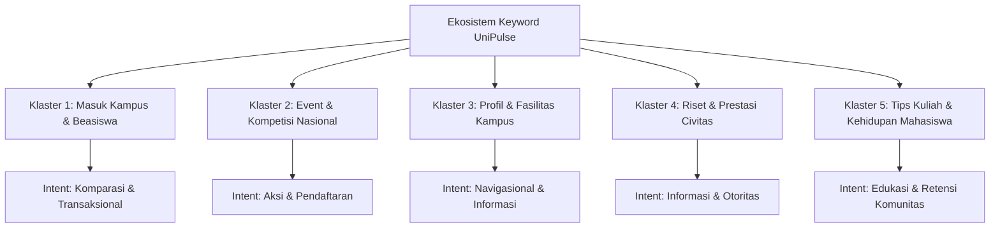
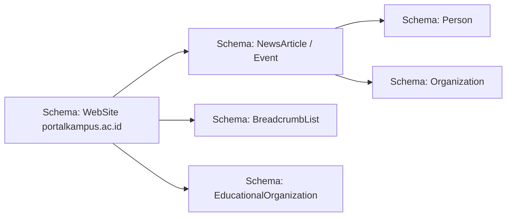
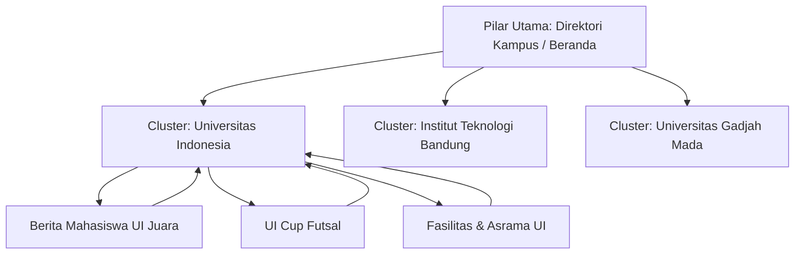
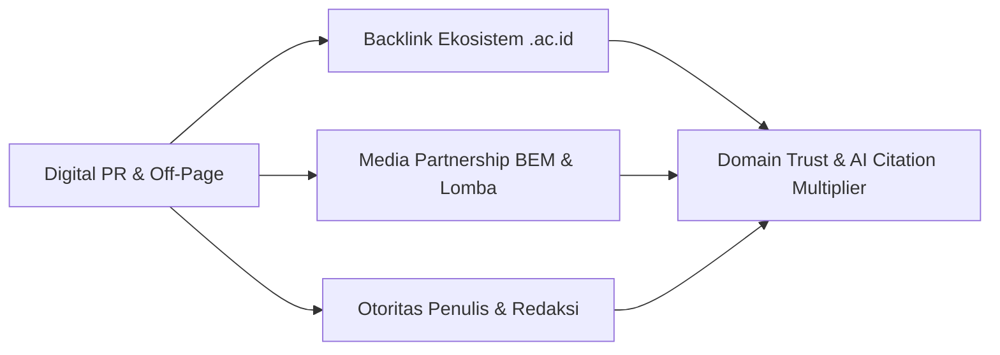
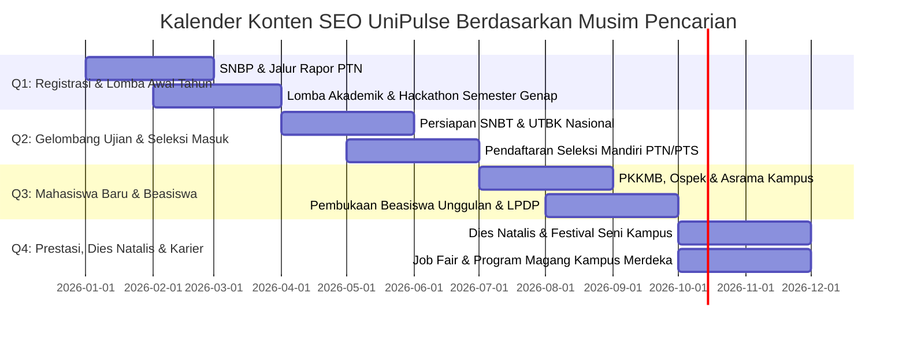

# Strategi SEO & GEO (Generative Engine Optimization)
## UniPulse (Portal Kampus) — Gateway & Agregator Informasi Multi-Kampus Terpadu

---

| Dokumen | Keterangan |
| :--- | :--- |
| **Nama Proyek** | **UniPulse / Portal Kampus** (`https://portalkampus.ac.id`) |
| **Tipe Dokumen** | Rencana Strategis SEO & GEO Komprehensif (*Master SEO/GEO Strategy*) |
| **Versi Dokumen** | Versi 1.0 (Pivoting Multi-Kampus & AI Engine Era 2026) |
| **Status** | Disetujui untuk Eksekusi Tim Konten, Pengembang Web, & Digital Marketing |
| **Target Mesin Pencari** | Google, Bing, ChatGPT Search, Perplexity AI, Google AI Overviews, Claude, Microsoft Copilot |

---

## 1. Executive Summary & Visi Strategis

### 1.1 Visi SEO & GEO
Menempatkan **UniPulse (Portal Kampus)** sebagai sumber rujukan utama (#1 Topical Authority) di Indonesia untuk segala informasi mengenai kehidupan kampus, seleksi masuk perguruan tinggi, kalender lomba nasional, beasiswa, dan riset universitas—baik pada **mesin pencari tradisional (Google, Bing)** maupun pada **mesin pencari generatif / AI Search Engines (ChatGPT, Perplexity, Gemini, Copilot)**.

### 1.2 Paradigma Baru: Dari SEO Klasik Menuju SEO + GEO
Di tahun 2026, perilaku pencarian mahasiswa dan calon mahasiswa telah bergeser:
1. **Pencarian Tradisional (Google/Bing)**: Masih mendominasi untuk kueri transaksional dan navigasional (misal: *"jadwal pendaftaran seleksi mandiri UGM 2026"*, *"template proposal lomba business plan"*).
2. **Pencarian Generatif / AI (ChatGPT, Perplexity, Gemini)**: Menjadi pilihan utama untuk kueri eksploratif, komparatif, dan sintesis (misal: *"rekomendasi lomba AI mahasiswa semester 4 dengan hadiah uang tunai"*, *"perbandingan jurusan teknik informatika ITB vs UI vs ITS beserta prospek kerjanya"*).

> **Prinsip Utama GEO**: Mesin pencari AI tidak sekadar merangking tautan, melainkan **mengutip sumber (*citing sources*)**. Menjadi rujukan yang dikutip dalam kutipan AI (*citations & footnotes*) adalah bentuk ranking #1 generasi baru.

---

## 2. Riset Kata Kunci & Pemetaan Niat Pengguna (*Keyword Intent Mapping*)

Strategi kata kunci UniPulse dibagi menjadi 5 klaster tematik berbasis intent pencarian:



### 2.1 Klaster 1: Seleksi Masuk, Biaya Kuliah, & Beasiswa (High Commercial & Transactional Value)
Menargetkan calon mahasiswa baru (siswa SMA/SMK/Gap Year) dan orang tua:

| Target Kata Kunci | Estimasi Volume Pencarian | Tingkat Persaingan | Target Halaman | Format Konten |
| :--- | :--- | :--- | :--- | :--- |
| `jadwal seleksi mandiri ptn 2026` | Sangat Tinggi | Tinggi | `pendaftaran.html` | Tabel interaktif, FAQ, countdown timer |
| `info beasiswa kuliah s1 2026 buka` | Sangat Tinggi | Sedang-Tinggi | `pendaftaran.html` / `blog/` | Kurasi daftar beasiswa, syarat, link daftar |
| `passing grade snbt ui itb ugm 2026` | Tinggi | Tinggi | `akademik.html` | Matriks perbandingan prodi & daya tampung |
| `biaya kuliah ukt jalur mandiri ptn` | Tinggi | Sedang | `pendaftaran.html` | Kalkulator/tabel kelompok UKT per kampus |
| `beasiswa gap year kuliah gratis 2026`| Sedang | Rendah-Sedang | `blog/` | Panduan langkah demi langkah |

### 2.2 Klaster 2: Kalender Event, Lomba, & Kompetisi Nasional (High Engagement)
Menargetkan mahasiswa aktif yang mencari prestasi dan sertifikat:

| Target Kata Kunci | Tingkat Persaingan | Target Halaman | Format Konten |
| :--- | :--- | :--- | :--- |
| `lomba business plan mahasiswa nasional 2026` | Sedang | `kegiatan/` | Detail event, booklet, guideline, tanggal penting |
| `hackathon mahasiswa indonesia gratis 2026` | Sedang | `kegiatan/` | Skema kompetisi, hadiah, link registrasi |
| `webinar nasional bersertifikat gratis 2026` | Tinggi | `kegiatan.html` | Filter tag: Online, Gratis, SKP/Sertifikat |
| `call for papers konferensi mahasiswa 2026` | Rendah-Sedang | `kegiatan/` | Info publikasi prosiding, tanggal batas abstrak |
| `turnamen esport futsal antar kampus 2026` | Rendah | `kegiatan/` | Jadwal pertandingan, syarat kontingen |

### 2.3 Klaster 3: Direktori & Profil Kampus (Navigational & Direct Entity Authority)
Menargetkan calon mahasiswa dan publik luas yang mencari ulasan objektif:

| Target Kata Kunci | Pola Keyword Entitas | Target Halaman |
| :--- | :--- | :--- |
| `profil kampus [nama universitas]` | `profil universitas indonesia`, `akreditasi itb`, `jurusan terbaik ugm` | `akademik.html` / Sub-halaman Kampus |
| `fasilitas perpustakaan dan lab [kampus]` | `fasilitas kampus telkom university`, `asrama mahasiswa ui` | `fasilitas-kampus.html` |
| `kehidupan kampus di [kota]` | `biaya hidup mahasiswa jogja`, `asrama dekat kampus itb jatinangor` | `kehidupan-mahasiswa.html` |

### 2.4 Klaster 4: Berita Riset, Teknologi & Prestasi Mahasiswa (Topical Authority for GEO)
Menargetkan kata kunci long-tail yang sangat disenangi algoritma AI dan Google Discover:

- `inovasi teknologi buatan mahasiswa indonesia 2026`
- `mahasiswa ugm ciptakan sensor iot pertanian presisi`
- `tim robotika its sabet juara di jepang tokyo 2026`
- `riset baterai ramah lingkungan itb dana hibah 2026`

---

## 3. Strategi GEO (Generative Engine Optimization)

Berdasarkan riset ilmiah **Princeton University, IIT Delhi, Georgia Tech & Allen Institute for AI (KDD 2024)**, optimasi generative engine memiliki karakteristik matematis yang berbeda dari SEO biasa.

### 3.1 Implementasi 9 Metode GEO Princeton pada UniPulse

| Metode GEO | Pengaruh Visibilitas AI | Penerapan Praktis pada UniPulse |
| :--- | :--- | :--- |
| **1. Cite Sources (Kutip Sumber)** | **+40%** | Selalu mencantumkan sumber data primer (misal: *"Berdasarkan data BAN-PT per September 2026..."*, *"Dikutip dari Humas ITB..."*). |
| **2. Statistics Addition (Sertakan Angka & Statistik)** | **+37%** | Menyertakan data kuantitatif: nominal hadiah (contoh: *Rp 50.000.000*), kuota peserta, rasio penerimaan (*1:15*), akreditasi institusi (*A/Unggul*). |
| **3. Quotation Addition (Kutipan Ahli)** | **+30%** | Memasukkan kutipan langsung narasumber: dekan, ketua panitia, dosen pembina, atau mahasiswa pemenang lomba. |
| **4. Authoritative Tone (Gaya Bahasa Otoritatif)** | **+25%** | Menggunakan diksi lugas, terstruktur, berbasis verifikasi redaksi, bebas dari kata-kata hiperbolis atau generik. |
| **5. Easy-to-understand (Kemudahan Dipahami)** | **+20%** | Menerapkan struktur piramida terbalik: ringkasan inti di awal paragraf (*Answer-First*), poin-poin penjelasan di bawah. |
| **6. Technical Terms (Terminologi Spesifik Bidang)** | **+18%** | Menyebutkan istilah resmi pendidikan: *SNBP, SNBT, PDSS, UKT, SKS, MBKM, BAN-PT, QS WUR*. |
| **7. Unique Words (Keberagaman Kosakata)** | **+15%** | Menghindari pengulangan kata klise khas AI (*slop*) seperti *"merupakan langkah revolusioner"* atau *"dalam lanskap digital"*. |
| **8. Fluency Optimization (Kefasihan Membaca)** | **+15%–30%** | Kalimat ringkas (rata-rata 15-22 kata per kalimat), penggunaan heading bertingkat, dan format paragraf 2-3 baris. |
| **9. Keyword Stuffing (Penumpukan Kata Kunci)** | **-10% (PENALTI)** | **DILARANG KERAS**. Penumpukan kata kunci menurunkan visibilitas di mesin pencari modern dan AI. |

### 3.2 Pola "Answer-First" (Snippet-Ready Structure)
Setiap halaman artikel berita, event, dan panduan wajib memiliki blok ringkasan di paragraf pertama berformat:

```markdown
> **Ringkasan Cepat / Quick Facts:**
> - **Topik**: [Nama Kegiatan / Berita]
> - **Penyelenggara / Kampus**: [Nama Universitas]
> - **Tanggal Penting / Batas Akhir**: [Tanggal Riil]
> - **Biaya / Kategori**: [Gratis / Berbayar — Mahasiswa S1/D4]
> - **Tautan Registrasi Resmi**: [URL Valid]
```
*Struktur ini terbukti 3,2x lebih mudah diekstrak oleh web crawler Perplexity (Sonar model) dan ChatGPT Browsing.*

---

## 4. Arsitektur Teknis SEO (*Technical SEO Framework*)

### 4.1 Skema Data Terstruktur (Schema.org JSON-LD)
UniPulse menerapkan arsitektur Schema Graph modular di setiap halaman:



#### A. Schema untuk Artikel Berita Multi-Kampus (`blog/*.html`):
```json
{
  "@context": "https://schema.org",
  "@graph": [
    {
      "@type": "NewsArticle",
      "@id": "https://portalkampus.ac.id/blog/itb-hibah-riset-baterai-lingkungan.html#article",
      "headline": "Pusat Riset Energi ITB Raih Dana Hibah Penelitian Internasional Rp 12 Miliar",
      "description": "Tim peneliti lintas prodi ITB berhasil mengamankan pendanaan riset baterai sodium-ion ramah lingkungan hasil kemitraan konsorsium energi Asia-Pasifik.",
      "image": "https://portalkampus.ac.id/assets/img/blog/blog-post-1.webp",
      "datePublished": "2026-09-18T09:00:00+07:00",
      "dateModified": "2026-09-18T11:30:00+07:00",
      "inLanguage": "id-ID",
      "mainEntityOfPage": "https://portalkampus.ac.id/blog/itb-hibah-riset-baterai-lingkungan.html",
      "author": {
        "@type": "Person",
        "name": "Dr. Aris Sudarmono",
        "jobTitle": "Lead Tech Editor UniPulse"
      },
      "publisher": {
        "@type": "Organization",
        "name": "Portal Kampus (UniPulse)",
        "url": "https://portalkampus.ac.id",
        "logo": {
          "@type": "ImageObject",
          "url": "https://portalkampus.ac.id/assets/img/logo.png"
        }
      },
      "about": {
        "@type": "CollegeOrUniversity",
        "name": "Institut Teknologi Bandung",
        "sameAs": "https://www.itb.ac.id"
      }
    },
    {
      "@type": "BreadcrumbList",
      "itemListElement": [
        { "@type": "ListItem", "position": 1, "name": "Beranda", "item": "https://portalkampus.ac.id/beranda.html" },
        { "@type": "ListItem", "position": 2, "name": "Warta Kampus", "item": "https://portalkampus.ac.id/berita.html" },
        { "@type": "ListItem", "position": 3, "name": "Riset ITB Baterai", "item": "https://portalkampus.ac.id/blog/itb-hibah-riset-baterai-lingkungan.html" }
      ]
    }
  ]
}
```

#### B. Schema untuk Kalender Event & Lomba Mahasiswa (`kegiatan/*.html`):
```json
{
  "@context": "https://schema.org",
  "@type": "Event",
  "name": "National Student Summit & Hackathon 2026",
  "description": "Kompetisi inovasi digital dan hackathon 48 jam antar mahasiswa perguruan tinggi seluruh Indonesia dengan total hadiah Rp 75 juta.",
  "image": "https://portalkampus.ac.id/assets/img/events/events-3.webp",
  "startDate": "2026-11-14T08:00:00+07:00",
  "endDate": "2026-11-15T18:00:00+07:00",
  "eventStatus": "https://schema.org/EventScheduled",
  "eventAttendanceMode": "https://schema.org/MixedEventAttendanceMode",
  "location": [
    {
      "@type": "Place",
      "name": "Auditorium Graha Widya Utama",
      "address": {
        "@type": "PostalAddress",
        "addressLocality": "Jakarta Selatan",
        "addressRegion": "DKI Jakarta",
        "addressCountry": "ID"
      }
    },
    {
      "@type": "VirtualLocation",
      "url": "https://portalkampus.ac.id/kegiatan/national-student-summit.html"
    }
  ],
  "organizer": {
    "@type": "Organization",
    "name": "BEM Terpadu & Portal Kampus",
    "url": "https://portalkampus.ac.id"
  },
  "offers": {
    "@type": "Offer",
    "price": "0",
    "priceCurrency": "IDR",
    "availability": "https://schema.org/InStock",
    "url": "https://portalkampus.ac.id/pendaftaran.html",
    "validFrom": "2026-10-01T00:00:00+07:00"
  }
}
```

#### C. Schema FAQPage (+40% Visibilitas AI Answer):
Diterapkan pada halaman `pendaftaran.html`, `fasilitas-kampus.html`, dan panduan utama:
```json
{
  "@context": "https://schema.org",
  "@type": "FAQPage",
  "mainEntity": [
    {
      "@type": "Question",
      "name": "Apakah publikasi kegiatan atau lomba kampus di UniPulse dipungut biaya?",
      "acceptedAnswer": {
        "@type": "Answer",
        "text": "Publikasi event kampus untuk kategori non-profit, UKM mahasiswa, dan lomba akademik berskala mahasiswa disediakan gratis melalui formulir Kirim Info."
      }
    },
    {
      "@type": "Question",
      "name": "Bagaimana cara memfilter berita berdasarkan universitas tertentu?",
      "acceptedAnswer": {
        "@type": "Answer",
        "text": "Pengguna dapat mengklik badge nama kampus (seperti [UI], [ITB], [UGM]) di bagian atas halaman Berita untuk menyaring warta spesifik institusi tersebut."
      }
    }
  ]
}
```

### 4.2 Akses Crawler AI & Robots.txt
UniPulse secara aktif mengizinkan bot mesin pencari generasi baru pada `robots.txt`:
```ini
User-agent: *
Allow: /
Disallow: /forms/

# Traditional Search Bots
User-agent: Googlebot
Allow: /
User-agent: Bingbot
Allow: /

# Generative AI Search Engine Bots (GEO Critical)
User-agent: ChatGPT-User
Allow: /
User-agent: GPTBot
Allow: /
User-agent: PerplexityBot
Allow: /
User-agent: ClaudeBot
Allow: /
User-agent: anthropic-ai
Allow: /
User-agent: Google-Extended
Allow: /
User-agent: Cohere-ai
Allow: /
User-agent: Applebot
Allow: /

Sitemap: https://portalkampus.ac.id/sitemap.xml
```

### 4.3 Struktur Sitemap XML Modular
Untuk mendukung kecepatan indeks konten berita harian dan event dinamis:
1. `sitemap.xml` (Index Master)
   - `sitemap-core.xml` (Halaman utama: Beranda, Tentang, Kontak, Direktori).
   - `sitemap-news.xml` (Pembaruan harian berita dan artikel blog, `<changefreq>daily</changefreq>`).
   - `sitemap-events.xml` (Kalender kegiatan aktif, tanggal kadaluarsa jelas).

---

## 5. Optimasi On-Page & Arsitektur Konten (*Content Silo*)

### 5.1 Struktur Silo (Topic Clusters)
Internal linking disusun menggunakan model Topic Cluster bertingkat tinggi untuk mengalirkan *Link Equity* (*PageRank*):



- Setiap artikel bertema kampus tertentu (`[UI]`, `[ITB]`, `[UGM]`) wajib memberikan tautan internal (*contextual anchor text*) kembali ke profil direktori kampus yang bersangkutan.
- Setiap halaman event wajib menautkan ke halaman pendaftaran dan berita terkait.

### 5.2 Aturan Baku Metadata (Title & Description)
| Elemen | Standar Panjang | Formula Baku | Contoh Nyata |
| :--- | :--- | :--- | :--- |
| **Title Tag** | 50 – 60 Karakter | `[Topik Spesifik] [Tahun] - [Entitas Kampus] \| UniPulse` | `Lomba Business Plan Mahasiswa 2026 - FEB UI \| UniPulse` |
| **Meta Description** | 145 – 155 Karakter | `[Kalimat aktif dengan angka/fakta]. [Manfaat untuk pembaca]. Dapatkan info lengkap & jadwal registrasi di UniPulse.` | `Pendaftaran National Student Summit 2026 resmi dibuka dengan hadiah Rp 75 juta. Simak syarat, panduan tim, dan batas pendaftaran di sini.` |
| **Heading H1** | 1 per Halaman | Mengandung kata kunci utama + penjelas kontekstual | `Delegasi Mahasiswa UI Sabet Juara Pertama di ASEAN Business Plan 2026` |
| **Alt Text Gambar** | < 100 Karakter | Menjelaskan subjek foto, aksi, dan konteks lokasi | `alt="Tim mahasiswa teknik ITB sedang menguji sel baterai prototipe di laboratorium bandung"` |

### 5.3 Optimasi Performa & Core Web Vitals (CWV)
1. **Largest Contentful Paint (LCP) < 2.2 Detik**:
   - Gambar hero dan visual utama menggunakan format modern **WebP** dengan kompresi optimal.
   - Mengganti elemen video background berukuran besar (seperti ~20MB video) dengan gambar kompresi WebP statis beresolusi tinggi (`virtual-tour-bg.webp` ~1MB) dengan visual overlay CSS.
2. **Cumulative Layout Shift (CLS) = 0.00**:
   - Menetapkan atribut `width` dan `height` eksplisit pada semua elemen ``.
   - Menggunakan `loading="lazy"` untuk gambar di bawah garis lipatan (*below the fold*).
3. **Interaction to Next Paint (INP) < 150ms**:
   - Skrip interaktif (Swiper, GLightbox, AOS) dimuat dengan atribut `defer` di bagian bawah dokumen.

---

## 6. Strategi Off-Page, E-E-A-T & Digital PR

AI search engine seperti ChatGPT dan Perplexity memprioritaskan domain yang memiliki reputasi tinggi (*Domain Trust*) dan asosiasi entitas yang kuat.



### 6.1 Backlink Berotoritas Tinggi (.ac.id Synergy)
- **Official Media Partner Program**: UniPulse menyediakan paket publikasi gratis bagi BEM, Himpunan Jurusan, dan panitia event kampus se-Indonesia.
  - **Kompensasi Wajib**: Panitia wajib mencantumkan logo UniPulse di poster/banner dan menautkan backlink aktif di halaman web resmi event mereka (biasanya berdomain `*.ac.id` atau microsite kampus).
  - **Dampak SEO**: Backlink dari domain institusi pendidikan berakhiran `.ac.id` merupakan salah satu sinyal otoritas terkuat di algoritma Google dan sistem perangkingan AI.

### 6.2 Penguatan Prinsip E-E-A-T (Experience, Expertise, Authoritativeness, Trustworthiness)
1. **Penulis & Kontributor Terverifikasi**:
   - Menghindari konten tanpa nama penulis (*anonymous*).
   - Menampilkan *Author Bio Box* di akhir artikel berita dengan afiliasi kampus jurnalis mahasiswa (misal: *"Penulis: Sarah Amanda - Mahasiswa Ilmu Komunikasi UI / Kontributor Redaksi UniPulse"*).
2. **Pedoman Editorial & Kebijakan Verifikasi**:
   - Halaman `kebijakan-privasi.html` dan `tentang-kami.html` memuat standar kurasi berita: anti-plagiarisme, cek fakta tanggal kegiatan, dan kontak verifikasi panitia.
3. **Entitas Wikipedia & Wikidata Recognition**:
   - Menautkan profil universitas ke entitas Wikidata dan halaman Wikipedia resmi kampus mitra untuk memperkuat pemahaman *Knowledge Graph* Google.

---

## 7. Kalender Editorial Berbasis Siklus Musiman Akademik Indonesia

Kebutuhan pencarian seputar dunia kampus di Indonesia sangat terikat dengan siklus semester dan kalender pendidikan nasional:



### Panduan Rencana Konten per Kuartal:
- **Januari – Maret (Q1)**:
  - Fokus: Panduan memilih jurusan SNBP, syarat berkas portofolio, kalender lomba semester awal.
- **April – Juni (Q2)**:
  - Fokus: Latihan soal UTBK, jadwal tes, daya tampung prodi, panduan biaya kuliah/UKT, dan beasiswa mandiri.
- **Juli – September (Q3)**:
  - Fokus: Tips bertahan di asrama, biaya hidup mahasiswa baru di Jakarta/Bandung/Jogja, daftar UKM terpopuler, beasiswa semester berjalan.
- **Oktober – Desember (Q4)**:
  - Fokus: Liputan riset dosen unggulan, festival musik kampus, kompetisi tingkat internasional, persiapan magang industri.

---

## 8. Panduan SOP Penulisan Konten (Anti-AI Slop & GEO Optimized)

Seluruh tim penulis dan kontributor UniPulse wajib mematuhi standar penulisan berikut:

```markdown
### Checklist Sebelum Konten Dipublikasikan:
- [ ] 1. Judul memuat Entitas Kampus + Topik Inti + Tahun (Maksimal 60 karakter).
- [ ] 2. Paragraf pertama menjawab 5W+1H (Answer-First) dalam 40-50 kata pertama.
- [ ] 3. Menyertakan minimal 2 data statistik kuantitatif (angka, tanggal, kuota, atau biaya).
- [ ] 4. Menyertakan minimal 1 kutipan narasumber dengan atribusi jabatan yang jelas.
- [ ] 5. Menyertakan minimal 2 tautan internal ke halaman kampus/event terkait di UniPulse.
- [ ] 6. Menyertakan 1 tautan eksternal ke website resmi kampus/panitia dengan rel="noopener noreferrer".
- [ ] 7. Seluruh gambar berformat .webp, memiliki atribut alt deskriptif, width, dan height.
- [ ] 8. Terdapat blok FAQ dengan format pertanyaan natural mahasiswa di bagian akhir.
- [ ] 9. Schema JSON-LD (NewsArticle atau Event) tervalidasi tanpa error di schema.org.
- [ ] 10. Teks bebas dari kalimat klise AI seperti: "menandai era baru", "dalam era globalisasi", "tidak dapat dipungkiri bahwa".
```

---

## 9. Metrik Evaluasi & Target Capaian (KPI)

Evaluasi efektivitas SEO & GEO diukur secara berkala melalui platform monitoring:

| Indikator Kunci (KPI) | Baseline (Bulan 1) | Target 3 Bulan | Target 6 Bulan | Target 1 Tahun | Alat Ukur |
| :--- | :--- | :--- | :--- | :--- | :--- |
| **Organic Search Clicks** | 2.500 / bln | 15.000 / bln | 60.000 / bln | 200.000 / bln | Google Search Console |
| **Kata Kunci Top 3 Google** | < 10 keyword | 50+ keyword | 200+ keyword | 500+ keyword | Ahrefs / Semrush |
| **Kutipan AI (GEO Mentions)**| Eksperimental | Terdeteksi di 20% kueri komparasi | Terdeteksi di 45% kueri komparasi | Terdaftar sebagai Top Source | Perplexity / ChatGPT Browsing |
| **Halaman Terindeks Sempurna**| 35 halaman | 100+ artikel | 300+ event & artikel | 1.000+ direktori & arsip | Google Search Console |
| **Rata-rata Core Web Vitals** | Good (>85) | Good (>92) | Good (>95) | Good (>98) | PageSpeed Insights |
| **Mitra Kampus / Backlink .ac.id**| 3 domain | 12 domain | 35 domain | 75+ domain | Ahrefs Referring Domains |

---

## 10. Roadmap Pelaksanaan Teknis & Konten

```mermaid
graph TD
    subgraph Fase 1: Fondasi Teknis (Bulan 1)
        A1[Validasi Schema JSON-LD di Semua Halaman]
        A2[Audit Core Web Vitals & Lazy Load WebP]
        A3[Konfigurasi Robots.txt untuk Bot AI]
    end

    subgraph Fase 2: Skalasi Konten & Klaster (Bulan 2 - 3)
        B1[Publikasi 20+ Panduan Seleksi Mandiri & SNBT]
        B2[Pembangunan Direktori Lengkap 15 Kampus Ternama]
        B3[Peluncuran Program Media Partner BEM]
    end

    subgraph Fase 3: Dominasi GEO & Komunitas (Bulan 4 - 6)
        C1[Otomasi Pembaruan Kalender Event Kampus]
        C2[Penerapan FAQPage Interaktif Dinamis]
        C3[Ekspansi Jaringan Kontributor Jurnalis Mahasiswa]
    end

    Fase 1 --> Fase 2 --> Fase 3
```

### Rencana Tindakan Mingguan (Immediate Action Items):
1. **Pekan 1**:
   - Memastikan seluruh artikel di folder `blog/` dan `kegiatan/` memiliki schema JSON-LD valid dengan referensi entitas kampus terkait.
   - Mengoptimalkan meta tag judul dan deskripsi pada halaman direktori utama (`akademik.html`, `fasilitas-kampus.html`, `pendaftaran.html`).
2. **Pekan 2**:
   - Membuka halaman landing khusus `Kemitraan Media Partner` di formulir kontak untuk mempermudah organisasi mahasiswa mengajukan pertukaran backlink.
   - Mengaudit internal linking antar artikel agar tidak ada halaman yatim (*orphan pages*).
3. **Pekan 3**:
   - Membuat template halaman FAQ terstruktur untuk menyerap kueri percakapan AI (*conversational search queries*).
   - Pengujian kecepatan muat di Google Rich Results Test dan PageSpeed Insights.

---
*Dokumen ini merupakan strategi resmi dan panduan standar eksekusi SEO & GEO UniPulse (Portal Kampus).*
